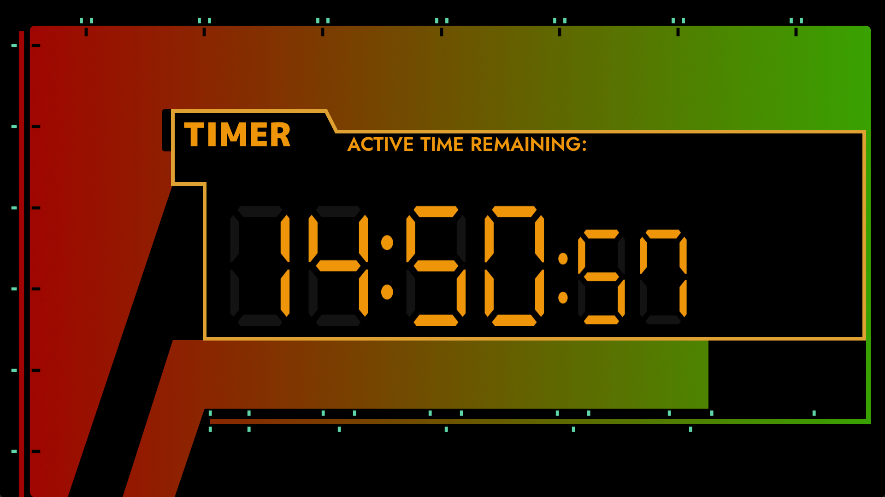

# EVA Timer

A toy project made with Godot 4 to look into using its UI systems along with
Godot Script.

Currently lacking interactive elements, requiring configuration via editor at
the moment.

Initial concept comes from a post by RadioSparks on 
[/r/Evangelion](https://www.reddit.com/r/evangelion/comments/c1j83i/i_couldnt_find_a_good_version_of_the_timer_so_i/).

Other references and samples from/inspired by Evangelion and VFD displays:
- [The Amazing UI Design of Evangelion](https://medium.com/astromono/the-amazing-ui-design-of-evangelion-de1126a7a85d)
- [Neon Genesis Evangelion - Fonts In Use](https://fontsinuse.com/uses/28760/neon-genesis-evangelion)
- [scottykwok/eva-clock-analysis](https://github.com/scottykwok/eva-clock-analysis)
- [Evangelion Interface Compilation on /r/Evangelion by purplehaze777777](https://www.reddit.com/r/evangelion/comments/95z8bt/i_found_the_interfaces_in_the_series_really_cool/)
- [Evangelion kitchen timer](https://youtu.be/ggj49bEUTO0)
- [1 Minute Evangelion Timer Countdown by Clocks and Timers](https://youtu.be/J26jG9rknN4)
- [VFD Displays by Posy](https://youtu.be/PkPSDOjhxwM)
- Honorable Mention: [evangelion ambience][evaAmb], an ASMR playlist providing soundscapes derived from scenes in Evangelion
- Honorable Font Mention: [Niramit](https://fonts.google.com/specimen/Niramit?preview.text=Do%20you%20love%20me%3F&preview.text_type=custom)

[evaAmb]:https://www.youtube.com/playlist?list=PLlzZhMzdZTUHwUkStRGcejoVOt9WLKMV5

Other Evangelion clock projects:
- [scottykwok/eva-clock](https://github.com/scottykwok/eva-clock) - Working web-based 2D/3D Evangelion clock
- [Wandmalfarbe/evangelion-clock-screensaver](https://github.com/Wandmalfarbe/evangelion-clock-screensaver) - A working screensaver for the Mac

## License

MIT License (c) Terry Nguyen 2023

See [LICENSE.md](LICENSE.md) for full license text.

See [THIRDPARTY.md](THIRDPARTY.md) for assets/libraries referenced by this project.
